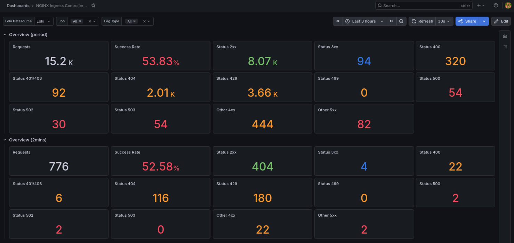
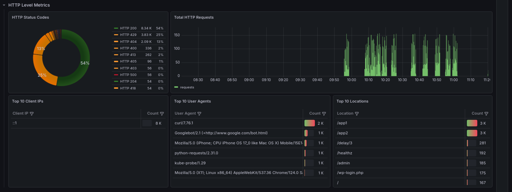
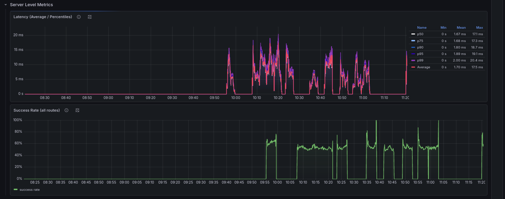
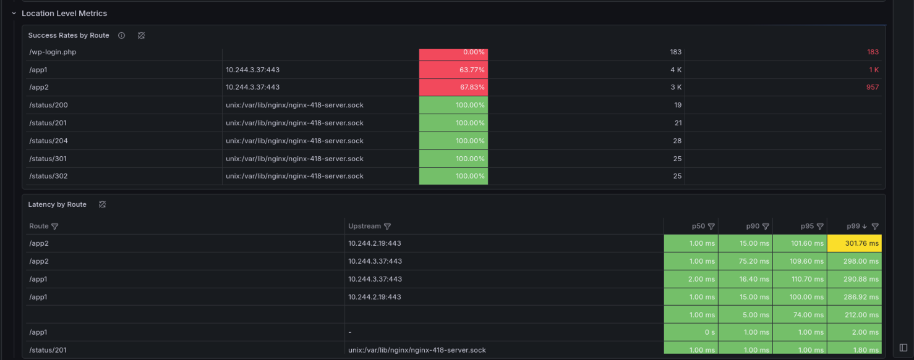

### Before You Start | NGINX - Minimally Viable Product

- The Unified Helmchart is not a publicly available resource
- Please contact F5 Professional Service / ConsultingSchedulingAPAC@f5.com for guidance


### Unified Helmchart Parameters (NGINX Ingress Controller)
```
aws eks update-kubeconfig --region <awsregion> --name <eksclustername>
```
```
alias k=kubectl
```

### Unified Helmchart Parameters (Container Ingress Service)
```
aws eks update-kubeconfig --region <awsregion> --name <eksclustername>
```
```
alias k=kubectl
```

### Unified Helmchart Parameters (Syslog, Alloy, Loki, Grafana)
```
aws eks update-kubeconfig --region <awsregion> --name <eksclustername>
```
```
alias k=kubectl
```

### Unified Helmchart Parameters (ArgoCD)
```
aws eks update-kubeconfig --region <awsregion> --name <eksclustername>
```
```
alias k=kubectl
```

### Monitoring / Observability









### Config Management
```
aws eks update-kubeconfig --region <awsregion> --name <eksclustername>
```
```
alias k=kubectl
```

```
alias k=kubectl
```
